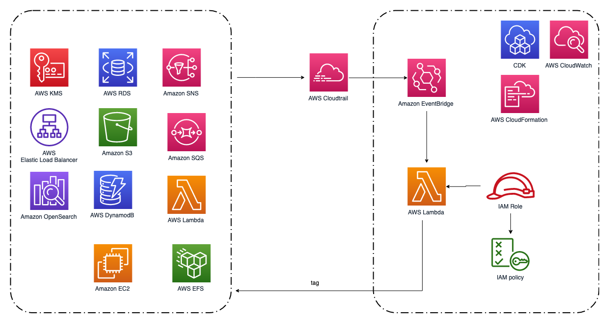

## Guide to Resource Tagging Automation
This is a Lambda function that can auto tagging newly created AWS resources. It is triggered by EventBridge events from CloudTrail logs. Currently it supports tagging EC2, S3, DynamoDB, RDS, Lambda, EFS, EBS, ELB, OpenSearch, SNS, SQS, ElastiCache and KMS.

Notice that the solution can only tag newly created resources, if you want to tag resources already created, please go to AWS Tag Editor Console, https://console.aws.amazon.com/resource-groups/tag-editor/find-resources.

If you want to deploy by CloudFormation, please refer https://github.com/aws-samples/resource-tagging-automation/tree/main/cloudformation.


### Project Architecture



### Prerequisite
1. A Linux machine to deploy CDK codes, with AWS IAM user's AK/SK configured.

2. Python3.8 and NodeJS are installed on the Linux machine.


### To deploy
1. Ensure CDK is installed
```
$ npm install -g aws-cdk
```

2. Create a Python virtual environment
```
$ python3 -m venv .venv
```

3. Activate virtual environment

_On MacOS or Linux_
```
$ source .venv/bin/activate
```

_On Windows_
```
% .venv\Scripts\activate.bat
```

4. Install the required dependencies.

```
$ pip install -r requirements.txt
```

5. Bootstrapping cdk environment.

```
$ cdk bootstrap
```

6. Synthesize (`cdk synth`) or deploy (`cdk deploy`) the example, use --parameters to pass additional parameters, use --require-approval to run without being prompted for approval, Please replace your own tags to the tags parameter.

```
$ cdk deploy --require-approval never --parameters tags='{"TagName1": "TagValue1","TagName2": "TagValue2"}'
```


### To check
1. Configure AWS CLI, please refer https://docs.aws.amazon.com/cli/latest/userguide/cli-configure-quickstart.html#cli-configure-quickstart-config

2. Ensure the Lambda function is successfully created.

```
$ aws lambda list-functions | grep FunctionName | grep resource-tagging-automation-function
```

3. Lambda function will be invoked when EventBridge rule triggered, such as EC2 Runinstances event, and the resource will be tagged by the Lambda function.


### To clean up afterwards:
Notice this operation will destroy the Lambda function and all other resources created by CDK.

```
$ cdk destroy
```

### Support more resources:
1. Go to AWS Console and navigate to Amazon EventBridge --> Rules, find and select rule 'resource-tagging-automation-awstaggingautomationruleXXXXXX', click 'Edit' button.
2. Go to step 2 and find 'Event pattern' chapter, add new resource in eventSource, eventName and source.
3. Keep clicking 'Next' button until click 'Update rule' in step 5.
4. Go to AWS Console and navigate to Lambda --> Functions, find out function 'resource-tagging-automation-function'.
5. Edit the function code, add a method to get newly created resources' ARN list from EventBridge rule event.
6. The method example is as below.
```
def aws_elasticloadbalancing(event):
    arnList = []
    if event['detail']['eventName'] == 'CreateLoadBalancer':
        print("tagging for new LoadBalancer...")
        lbs = event['detail']['responseElements']
        for lb in lbs['loadBalancers']:
            arnList.append(lb['loadBalancerArn'])
        return arnList
```

### Troubleshooting
If your account permissions aren't set up correctly, or if you stop a deployment, you may have to manually clean up deployed resources. Navigate to the CloudFormation console, select the stack that needs to be cleaned up, and click the Delete button to destroy the stack manually and start over.


### Security
See [CONTRIBUTING](CONTRIBUTING.md#security-issue-notifications) for more information.


### License
This library is licensed under the MIT-0 License. See the LICENSE file.
