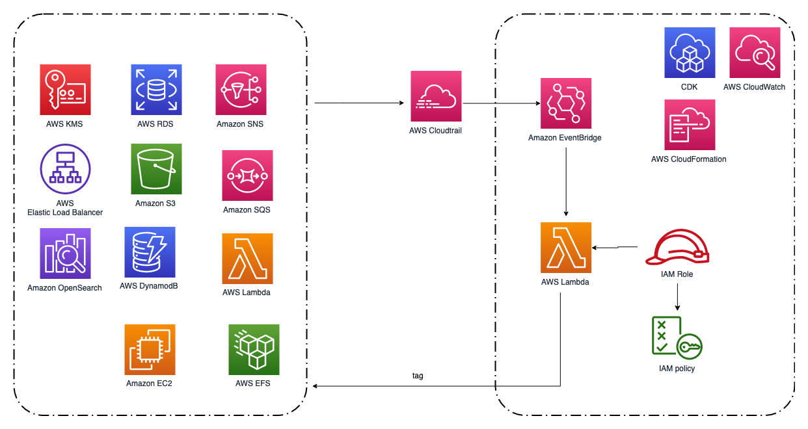

## 资源自动打标签 — CloudFormation 部署

本目录提供 CloudFormation 模版，用于部署资源自动打标签方案。该方案支持为新创建的 EC2、ELB、EFS、EBS、S3、RDS、DynamoDB、Lambda、OpenSearch、ElastiCache、Redshift、SageMaker、SNS、SQS、KMS、MQ、MSK 和 ECS 资源自动打上标签。

### 准备
1. 下载 CloudFormation 模版 `resource-tagging-automation.yaml`。
2. AWS 账号。

### 架构图

### 部署
1. 打开 AWS Console，导航到 CloudFormation。
2. 点击 **Create Stack**。
3. 点击 **Upload a template file**，选择下载到本地的 CloudFormation 模版。
4. 在 **Stack name** 输入栈名称。
5. 配置参数：

    | 参数 | 默认值 | 说明 |
    |---|---|---|
    | `AutomationTags` | _(空)_ | 自动为每个资源打上的标签，JSON 对象格式，例如：`{"TagName1": "TagValue1","TagName2": "TagValue2"}` |
    | `LambdaAutoTaggingFunctionName` | `resource-tagging-automation-function` | Lambda 函数名称 |
    | `EventBridgeRuleName` | `resource-tagging-automation-rules` | EventBridge 规则名称 |
    | `IAMAutoTaggingRoleName` | `resource-tagging-automation-role` | Lambda 使用的 IAM 角色名称 |
    | `IAMAutoTaggingPolicyName` | `resource-tagging-automation-policy` | IAM 自定义托管策略名称 |
    | `TrailName` | `resource-tagging-automation-trail` | 本栈创建的多区域 CloudTrail 名称 |
    | `TrailS3Bucket` | _(空)_ | 用于存放 CloudTrail 日志的现有 S3 桶名称。留空则自动创建名为 `tagging-log-<stack-suffix>` 的桶 |

6. 点击 **Next**，勾选 **I acknowledge that AWS CloudFormation might create IAM resources.**，然后点击 **Create stack**。
7. 栈创建通常需要 3–5 分钟完成。

### 说明
- 本栈创建的 CloudTrail 启用多区域，并包含全局服务事件。
- 当 `TrailS3Bucket` 留空时，将创建一个名为 `tagging-log-<stack-suffix>` 的新 S3 桶，`DeletionPolicy` 设置为 `Retain`。删除栈**不会**自动删除该桶，若不再需要日志请手动清理。
- 当 `TrailS3Bucket` 指向现有桶时，不会创建新桶；需要自行确保桶策略允许 `cloudtrail.amazonaws.com` 对相应前缀执行 `s3:GetBucketAcl` 与 `s3:PutObject`。

### 修改 tag
1. 进入 Lambda 控制台，选择 Lambda 函数（默认：`resource-tagging-automation-function`）。
2. 切换到 **Configuration** 标签页，选择 **Environment variables**，点击 **Edit** 修改 `tags` 环境变量的值。
3. 修改值（JSON 格式）后点击 **Save**。之后新创建的资源将被自动打上新标签。
